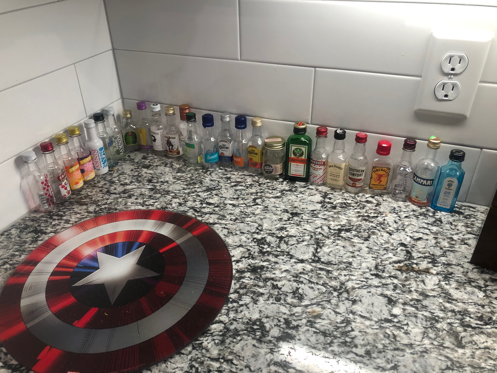

# Alcohol Prediction Machine Learning Model
## A model I use to predict the ranking of various spirits according to my girlfriend and her friend.*
###### *this is purely for my enjoyment I'm just having fun with this.
***
### Overview:
File overview:
- `rach_alc_model.py`: the main model script which can be launched with a simple python interpreter.  
- `curr_alcs.xlsx`: where the data is stored. A ranking of `0` represents the spirit to be predicted and `-1` represents a spirit loaded into the pandas dataframe but not trained upon (as it hasnt been tested yet).
- `notebooks/new_notebook.ipynb`: a (somewhat) regularly updated jupyter notebook that is used to view plots. 
- `junk/`: scrapped/old methods I'm keeping for posterity's sake

### Background
These rankings take this form:

with best being on the left, and right being the worst. 

I was looking at this one night and started to notice patterns within the rankings, and figured it wouldn't be all that hard to make a ML model to predict the rankings of incoming spirits.

### XGBoost Model
This uses a `XGBoost` Regression model, trained and tested with a 25/75 split. I use sklearn's `GridSearchCV` to hyperparamater tune, resulting in a RMSE of anywhere from 14 to 40 (the high fluctiation is due to the fact that this is a far smaller dataset than is meant for this type of workflow).

### Excel to Pandas ETL
I use a rather rudimentaty ETL process that begins with an Excel spreadsheet of the rankings with their various attributes (type, brand, abv, etc.). I then read this into a pandas dataframe so that XGBoost model can digest & process it. Note that this process could easily be converted to interact with a remote sql data storage should I want to, but there's just no use for that yet.